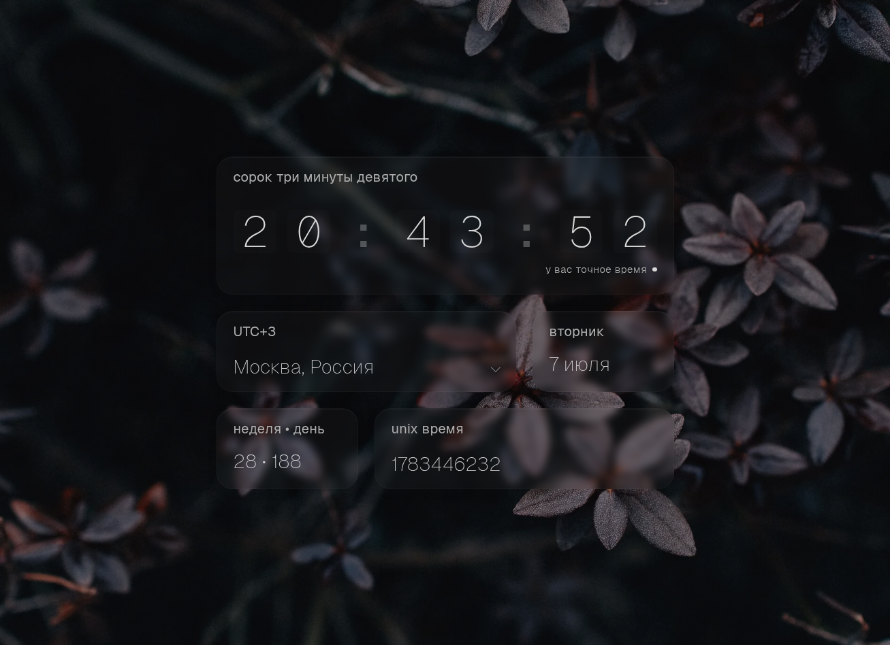

# settime

Точное время онлайн. Фронтенд [settime.ru](https://settime.ru): сверяет часы устройства с эталонным временем по WebSocket.

Backend: [github.com/teplostanski/api.settime.ru](https://github.com/teplostanski/api.settime.ru).



## Возможности

- синхронизация времени через WebSocket
- отображение расхождения с системными часами
- выбор часового пояса
- словесное время по-русски
- PWA

## Стек

React 19, TypeScript, Vite, Redux Toolkit, dayjs, Zod, WebSocket

## Запуск

```bash
npm install
npm run dev
```

Для локальной разработки по умолчанию используется prod API (`wss://api.settime.ru`, `.env.development`).

Для локального backend см. [github.com/teplostanski/api.settime.ru](https://github.com/teplostanski/api.settime.ru):

```bash
git clone https://github.com/teplostanski/api.settime.ru.git
cd api.settime.ru
npm install
npm run dev
```

## Переменные окружения

| Файл               | `VITE_WS_URL`          |
| ------------------ | ---------------------- |
| `.env.development` | `wss://api.settime.ru/ws` |
| `.env.production`  | `wss://api.settime.ru/ws` |
| `.env.example`     | шаблон                 |

Фоллбэк переменной `VITE_WS_URL` = `ws://localhost:8080` находится в `src/shared/config/time-server.ts`

Для CI нужно указать `VITE_WS_URL=wss://api.settime.ru/ws` в Settings -> Environments -> github-pages -> Environment variables.

## Сборка

```bash
npm run build
npm run preview
```

## Линт

```bash
npm run lint
```

## Связанные репозитории

| Репозиторий                                                                              | Описание        |
| ---------------------------------------------------------------------------------------- | --------------- |
| [github.com/teplostanski/api.settime.ru](https://github.com/teplostanski/api.settime.ru) | WebSocket + NTP |

<br>

[](https://donate.teplostanski.me)
